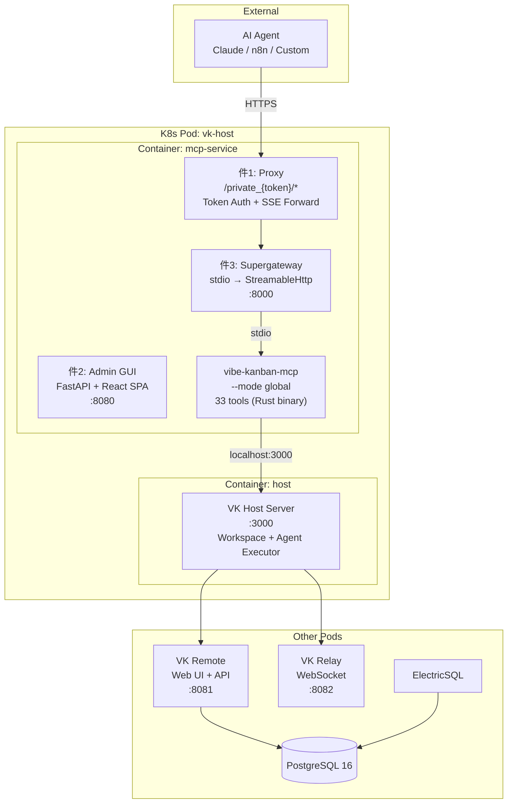

<p align="center">
  
</p>

<h1 align="center">Woow VK MCP Server</h1>

<p align="center">
  <strong>WoowTech Three-Piece MCP Service for Vibe Kanban</strong><br/>
  Proxy + Admin GUI + Supergateway Bridge — 33 VK Tools via Authenticated SSE/StreamableHttp
</p>

<p align="center">
  <a href="#architecture">Architecture</a> &bull;
  <a href="#tools">Tools</a> &bull;
  <a href="#screenshots">Screenshots</a> &bull;
  <a href="#deployment">Deployment</a> &bull;
  <a href="#connection">Connection</a> &bull;
  <a href="README_zh-TW.md">中文文件</a>
</p>

<p align="center">
  
  
  
  
  
</p>

---

## Overview

A production-ready MCP (Model Context Protocol) service that exposes 33 Vibe Kanban tools to external AI agents (Claude, n8n, custom) via authenticated HTTPS endpoints. Follows the WoowTech standard three-piece MCP pattern proven across K3s, Odoo, Hermes, and n8n deployments.

### How It Works

```
Claude App / AI Agent
  → HTTPS (Cloudflare Tunnel)
    → Proxy (token auth + reverse proxy)
      → Supergateway (stdio → StreamableHttp bridge)
        → vibe-kanban-mcp binary (33 tools, Rust)
          → VK Host API (localhost:3000, same Pod)
            → Self-hosted VK Remote (issues/kanban)
            → Self-hosted VK Relay (host connections)
```

---

## Architecture

### Three-Piece Pattern



### Sidecar Deployment

The MCP service runs as a **sidecar container** in the same Pod as the VK Host. They share a network namespace, enabling `localhost:3000` direct access without authentication (Host has no auth middleware — security boundary is the Pod network).

```
┌──────────────── K8s Pod: vk-host ────────────────┐
│                                                    │
│  Container: mcp-service        Container: host     │
│  ┌─────────────────────┐      ┌──────────────────┐│
│  │ Proxy    :8080       │      │ VK Host   :3000  ││
│  │ Gateway  :8000       │◄────►│ Claude Code      ││
│  │ vibe-kanban-mcp      │      │ OpenCode         ││
│  └─────────────────────┘      └──────────────────┘│
│       localhost network (shared)                    │
└────────────────────────────────────────────────────┘
```

---

## Tools

### 33 MCP Tools in 4 Categories

| Category | Count | Tools |
|----------|-------|-------|
| **A - Execution** | 10 | `start_workspace`, `create_session`, `run_session_prompt`, `get_execution`, `list_sessions`, `update_session`, `list_workspaces`, `update_workspace`, `delete_workspace`, `link_workspace_issue` |
| **B - Repo** | 5 | `list_repos`, `get_repo`, `update_setup_script`, `update_cleanup_script`, `update_dev_server_script` |
| **C - Issue/Kanban** | 17 | `list_organizations`, `list_org_members`, `list_projects`, `create_issue`, `list_issues`, `get_issue`, `update_issue`, `delete_issue`, `list_issue_priorities`, `assign_issue`, `unassign_issue`, `list_issue_assignees`, `add_issue_tag`, `remove_issue_tag`, `list_issue_tags`, `list_tags`, `create_issue_relationship`, `delete_issue_relationship` |
| **D - Context** | 1 | `get_context` |

### Dangerous Tools (destructive operations)

| Tool | Risk |
|------|------|
| `delete_workspace` | Permanently deletes workspace + worktree |
| `delete_issue` | Permanently deletes an issue |
| `start_workspace` | Creates worktrees on host filesystem |

> **Note**: This proxy-upstream architecture exposes all tools. Selective blocking requires the future own-server migration. See `deny-list.yaml`.

---

## Screenshots

### Login Page
<p align="center">
  
</p>

### Dashboard
System health overview showing MCP Server, Proxy, and Tunnel status.
<p align="center">
  
</p>

### Tools (33 VK MCP Tools)
Complete tool registry organized by category with danger flags.
<p align="center">
  
</p>

### Token Management
Generate, rotate, and manage MCP authentication tokens.
<p align="center">
  
</p>

### Log Viewer
Real-time supergateway and proxy logs.
<p align="center">
  
</p>

### Settings
MCP server configuration and connection settings.
<p align="center">
  
</p>

---

## Deployment

### Prerequisites

- K3s / Kubernetes cluster with existing VK stack (PostgreSQL, ElectricSQL, Remote, Relay, Host)
- `podman` or `docker` for building images
- Cloudflare account (for tunnel)

### Build

```bash
# Build the MCP service image
podman build -t vk-mcp:v1.0 .

# Import to K3s
podman save localhost/vk-mcp:v1.0 -o /tmp/vk-mcp.tar
# (use privileged Job to import into containerd)
```

### K8s Deployment (Sidecar)

Add the `mcp-service` container to the existing `vk-host` Pod:

```yaml
containers:
  - name: host          # existing
    image: localhost/vk-host:v0.1.43
    ports: [{containerPort: 3000}]
  - name: mcp-service   # NEW sidecar
    image: localhost/vk-mcp:v1.0
    ports:
      - {containerPort: 8080, name: mcp-admin}
      - {containerPort: 8000, name: mcp-sse}
    env:
      - {name: VIBE_BACKEND_URL, value: "http://localhost:3000"}
      - {name: MCP_AUTH_TOKEN, value: "<your-token>"}
```

### Cloudflare Tunnel

Add route: `your-mcp-domain.example.com` → `vk-host-svc:8080`

---

## Connection

### Claude App / Claude Desktop

```
https://<your-mcp-domain>/private_<token>/mcp
```

### Claude Code / Settings JSON

```json
{
  "mcpServers": {
    "vibe-kanban": {
      "type": "url",
      "url": "https://<your-mcp-domain>/private_<token>/mcp"
    }
  }
}
```

### Token Management

1. Login to Admin GUI: `https://<your-mcp-domain>/` (password: `admin`)
2. Navigate to **Tokens** page
3. Click **Rotate Token** to generate a new token
4. Use the token in your MCP connection URL

---

## Project Structure

```
woow_vk_mcp_server/
├── mcp_admin_core/          # 件1: Shared MCP proxy + auth (zero-change copy)
│   ├── proxy.py             # SSE/StreamableHttp reverse proxy with token auth
│   ├── process.py           # Subprocess manager for supergateway
│   ├── app.py               # FastAPI factory with SPA fallback
│   ├── auth/                # JWT middleware
│   └── config/              # JSON config store
├── vk_mcp_admin/            # 件2: VK-specific admin backend
│   ├── main.py              # create_app("VK MCP Admin")
│   ├── tool_registry.py     # 33 tools in 4 categories
│   └── routers/             # health, tools, tokens, logs, config
├── frontend/                # 件2: React SPA (Vite + TailwindCSS)
│   └── src/pages/           # Dashboard, Tools, Tokens, Logs, Settings, Login
├── Dockerfile               # Multi-stage: Node 22 + Python 3.12 + binary
├── entrypoint.sh            # Starts supergateway + uvicorn
├── deny-list.yaml           # Warning: all 33 tools exposed
├── .env.example             # Configuration template
└── pyproject.toml            # Python dependencies
```

---

## Test Results (33/33 = 100%)

All 33 MCP tools verified with full create → update → delete closed-loop testing:

| Category | Tools | Status |
|----------|-------|--------|
| C - Issue/Kanban | 18 tools | 18/18 PASS |
| B - Repo | 5 tools | 5/5 PASS |
| A - Execution | 10 tools | 10/10 PASS |
| **Total** | **33 tools** | **33/33 (100%)** |

---

## Live Instance

| Service | URL |
|---------|-----|
| MCP Admin GUI | https://woowtechkxs-vibekanban-mcp.woowtech.io |
| MCP Endpoint | `https://woowtechkxs-vibekanban-mcp.woowtech.io/private_{token}/mcp` |
| VK Remote (Web UI) | https://woowtechkxs-vibekanban.woowtech.io |
| VK Host | https://woowtechkxs-vibekanban-host.woowtech.io |

---

## Related

- [Woow VK Docker Compose All](https://github.com/WOOWTECH/Woow_vibekanban_docker_compose_all) — Full VK stack deployment (K3s + Podman)
- [Vibe Kanban](https://github.com/BloopAI/vibe-kanban) — Upstream project
- [MCP Specification](https://modelcontextprotocol.io/) — Model Context Protocol

---

## License

MIT License - see [LICENSE](LICENSE) for details.

---

<p align="center">
  <sub>Built by <a href="https://github.com/WOOWTECH">WOOWTECH</a> | Powered by <a href="https://github.com/BloopAI/vibe-kanban">Vibe Kanban</a> + <a href="https://modelcontextprotocol.io">MCP</a></sub>
</p>
