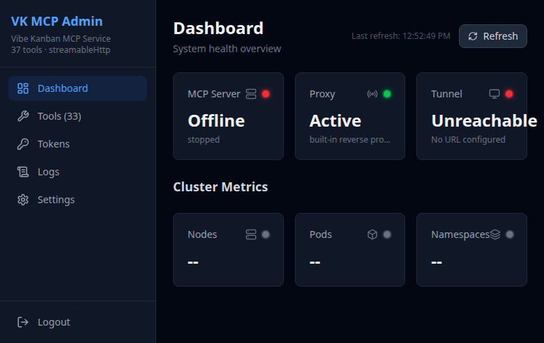
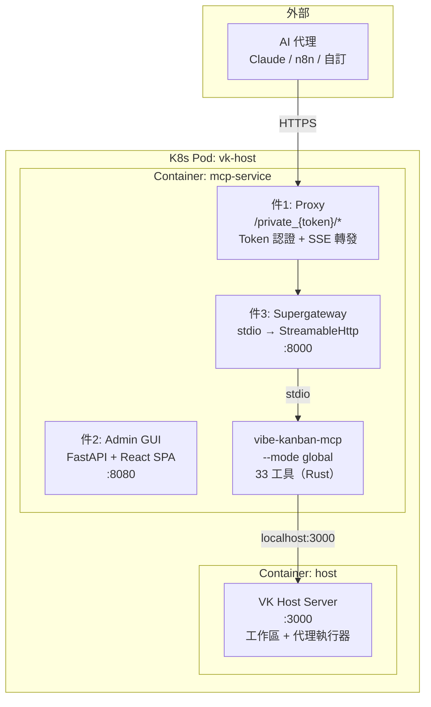
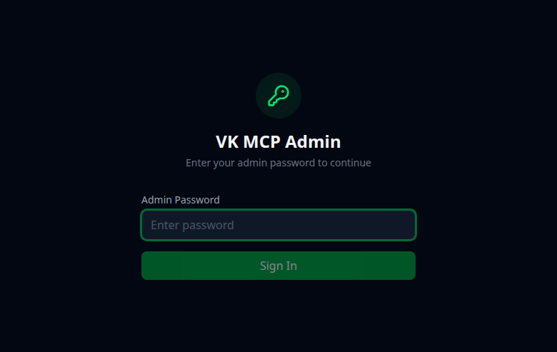
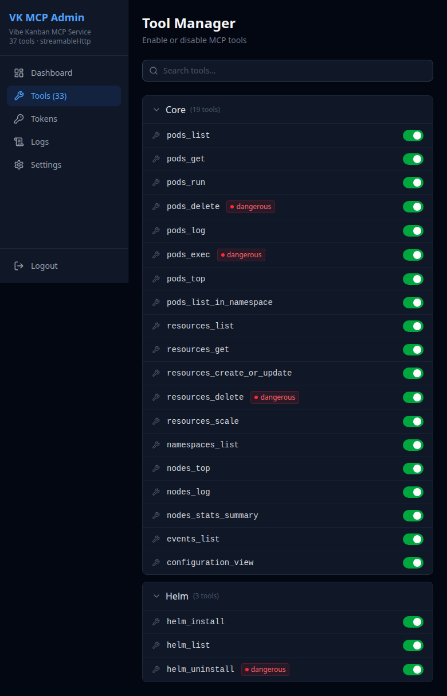
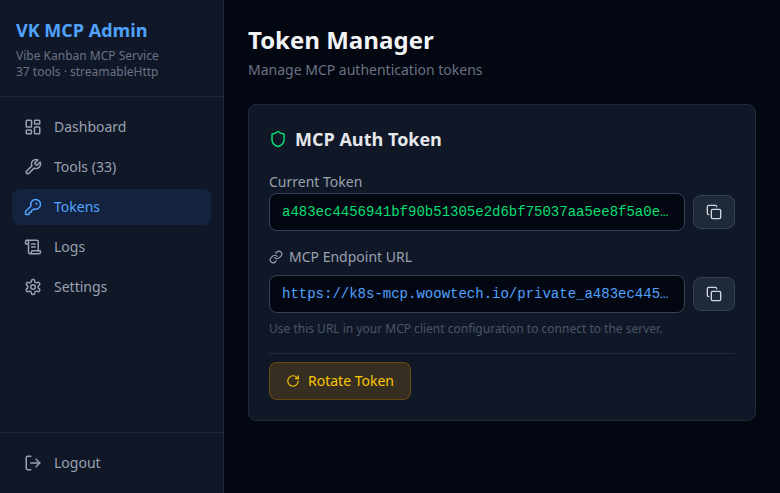
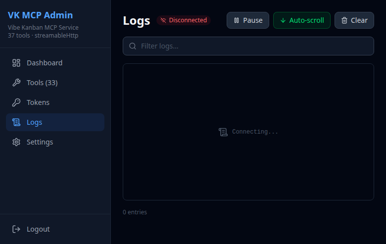
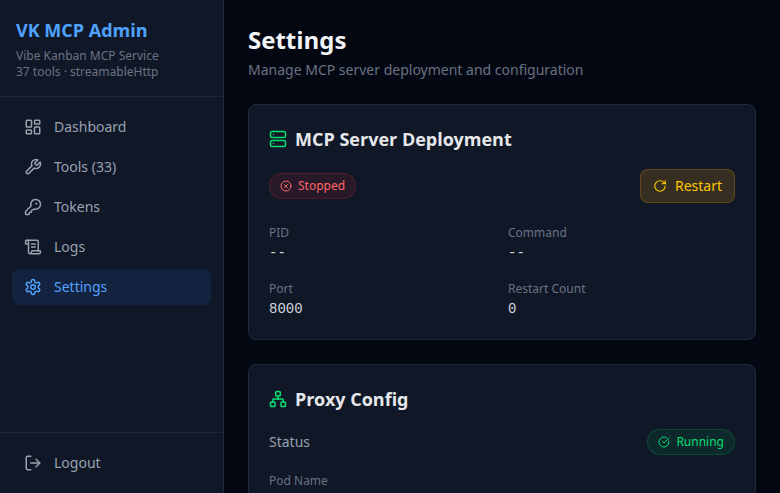

> [!WARNING]
> **已停用 / Deprecated（2026-09-12）**：這個 repo 已不再維護，也不再部署在 WOOWTECH 的叢集上，僅保留作為歷史參考。
> This repository is no longer maintained or deployed on WOOWTECH clusters and is kept for reference only.

<p align="center">
  
</p>

<h1 align="center">Woow VK MCP Server</h1>

<p align="center">
  <strong>WoowTech 三件式 MCP 服務 — Vibe Kanban 專用</strong><br/>
  Proxy + Admin GUI + Supergateway 橋接 — 33 個 VK 工具經認證 SSE/StreamableHttp 存取
</p>

<p align="center">
  <a href="#架構">架構</a> &bull;
  <a href="#工具清單">工具清單</a> &bull;
  <a href="#畫面截圖">截圖</a> &bull;
  <a href="#部署">部署</a> &bull;
  <a href="#連線方式">連線</a> &bull;
  <a href="README.md">English</a>
</p>

<p align="center">
  
  
  
  
  
</p>

---

## 概述

生產級 MCP（Model Context Protocol）服務，將自架 Vibe Kanban 平台的 33 個 MCP 工具（議題/看板、工作區、對話、版本庫管理）透過認證 HTTPS 端點暴露給外部 AI 代理（Claude、n8n、自訂）。遵循 WoowTech 標準三件式 MCP 架構，已在 K3s、Odoo、Hermes、n8n 部署中驗證。

### 運作方式

```
Claude App / AI 代理
  → HTTPS（Cloudflare Tunnel）
    → Proxy（token 認證 + 反向代理）
      → Supergateway（stdio → StreamableHttp 橋接）
        → vibe-kanban-mcp 二進位（33 工具，Rust）
          → VK Host API（localhost:3000，同 Pod）
            → 自架 VK Remote（議題/看板）
            → 自架 VK Relay（host 連線）
```

---

## 架構

### 三件式架構



### Sidecar 部署

MCP 服務作為 **sidecar 容器** 與 VK Host 在同一個 K8s Pod 中運行。共用網路命名空間，`localhost:3000` 直連無需認證（Host 無 auth middleware — 安全邊界是 Pod 網路隔離）。

---

## 工具清單

### 33 個 MCP 工具分 4 類

| 類別 | 數量 | 工具 |
|------|------|------|
| **A - 執行** | 10 | `start_workspace`, `create_session`, `run_session_prompt`, `get_execution`, `list_sessions`, `update_session`, `list_workspaces`, `update_workspace`, `delete_workspace`, `link_workspace_issue` |
| **B - 版本庫** | 5 | `list_repos`, `get_repo`, `update_setup_script`, `update_cleanup_script`, `update_dev_server_script` |
| **C - 議題/看板** | 17 | `list_organizations`, `list_org_members`, `list_projects`, `create_issue`, `list_issues`, `get_issue`, `update_issue`, `delete_issue`, `list_issue_priorities`, `assign_issue`, `unassign_issue`, `list_issue_assignees`, `add_issue_tag`, `remove_issue_tag`, `list_issue_tags`, `list_tags`, `create_issue_relationship`, `delete_issue_relationship` |
| **D - 上下文** | 1 | `get_context` |

### 危險工具（破壞性操作）

| 工具 | 風險 |
|------|------|
| `delete_workspace` | 永久刪除工作區 + worktree |
| `delete_issue` | 永久刪除議題 |
| `start_workspace` | 在 host 檔案系統建立 worktree |

---

## 畫面截圖

### 登入頁面
<p align="center">
  
</p>

### 儀表板
系統健康狀態總覽，顯示 MCP Server、Proxy 和 Tunnel 狀態。
<p align="center">
  
</p>

### 工具管理（33 個 VK MCP 工具）
完整工具註冊表，按類別分組，標示危險工具。
<p align="center">
  
</p>

### Token 管理
生成、輪替和管理 MCP 認證 token。
<p align="center">
  
</p>

### 日誌檢視器
即時 supergateway 和 proxy 日誌。
<p align="center">
  
</p>

### 設定
MCP 伺服器配置和連線設定。
<p align="center">
  
</p>

---

## 部署

### 前置需求

- K3s / Kubernetes 叢集，已部署 VK 套裝（PostgreSQL、ElectricSQL、Remote、Relay、Host）
- `podman` 或 `docker`（建構映像用）
- Cloudflare 帳號（tunnel 用）

### 建構

```bash
podman build -t vk-mcp:v1.0 .
```

### K8s 部署（Sidecar）

在現有 `vk-host` Pod 中加入 `mcp-service` 容器：

```yaml
containers:
  - name: host           # 現有
    image: localhost/vk-host:v0.1.43
  - name: mcp-service    # 新增 sidecar
    image: localhost/vk-mcp:v1.0
    ports:
      - {containerPort: 8080, name: mcp-admin}
      - {containerPort: 8000, name: mcp-sse}
    env:
      - {name: VIBE_BACKEND_URL, value: "http://localhost:3000"}
```

---

## 連線方式

### Claude App / Claude Desktop

```
https://<your-mcp-domain>/private_<token>/mcp
```

### Claude Code 設定

```json
{
  "mcpServers": {
    "vibe-kanban": {
      "type": "url",
      "url": "https://<your-mcp-domain>/private_<token>/mcp"
    }
  }
}
```

### Token 管理

1. 登入 Admin GUI：`https://<your-mcp-domain>/`（密碼：`admin`）
2. 到 **Tokens** 頁面
3. 點 **Rotate Token** 生成新 token
4. 在 MCP 連線 URL 中使用該 token

---

## 測試結果（33/33 = 100%）

所有 33 個 MCP 工具已通過完整的建立→更新→刪除閉環測試：

| 類別 | 工具數 | 結果 |
|------|--------|------|
| C - 議題/看板 | 18 | 18/18 PASS |
| B - 版本庫 | 5 | 5/5 PASS |
| A - 執行 | 10 | 10/10 PASS |
| **合計** | **33** | **33/33 (100%)** |

---

## 相關連結

- [Woow VK Docker Compose All](https://github.com/WOOWTECH/Woow_vibekanban_docker_compose_all) — 完整 VK 套裝部署
- [Vibe Kanban](https://github.com/BloopAI/vibe-kanban) — 上游專案
- [MCP 規範](https://modelcontextprotocol.io/) — Model Context Protocol

---

## 授權

MIT License

---

<p align="center">
  <sub>由 <a href="https://github.com/WOOWTECH">WOOWTECH</a> 建構 | 基於 <a href="https://github.com/BloopAI/vibe-kanban">Vibe Kanban</a> + <a href="https://modelcontextprotocol.io">MCP</a></sub>
</p>
